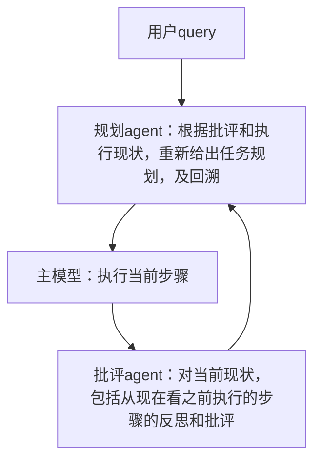

# O1

## 背景
我们认为，O1的思想在于：在训练方法已经几乎成为范式的今天，把计算资源更多的向推理倾斜，可以得到更好的效果。

所以，所谓的Q*或者蒙特卡洛搜索只是一种计算的方法，并不是O1的唯一实现。

我们认为，应该有一种更加简明、更加端到端的方法，可以更好地指导模型，实现规划和反思。

（现在开源的单模型推理方案，在我们看来只是带反思的cot模型而已，由于没有外部信息的接入，所以很容易陷入自身的逻辑缺陷里造成死循环）

## 实现思路
我们认为可以从顶层设计的角度更好的解决这一问题。

所以，我们将prm模型和蒙特卡洛搜索的功能分离开，提取出 **`规划agent(模型)`**、**`主模型`** 和 **`批评agent(模型)`**。

## 意义
### all your need is 语义
1. 我们的思路相当于是把奖励模型的打分变成了明确的文本（即语义信息），我们认为这样可以比蒙特卡洛搜索更好的指导规划模型进行回溯和搜索（因为有不同模型的、明确的批评信息存在，可以避免像单模型推理那样陷入死循环）。

(当然，这种分离的架构使得就算想继续用蒙特卡洛搜索也是可以的)

2. 并且我们这种分离的架构，在工程实现上更简单了：1、所有涉及到的技术都是已经存在的。2、可以使用lora训练agent，这样对推理友好，只需一个主模型即可。

## 待办事项
- [ ] 使用大模型生成适合复杂逻辑推理的问题（样本）
- [ ] 手动跑通全流程，确定各处prompt等细节
- [ ] 确定样本的存储格式（可以查看待回溯的开源数据格式）
- [ ] 建立前台显示和编辑网页，用于生成数据
- [ ] 训练规划模型（lora）
  - [ ] 前期手搓PRM语料，后面数据飞轮起来后就只需做校验了
- [ ] 训练批评模型（lora）
- 增强功能
  - [ ] 使用xml标签，提供网络搜索的能力，弥补模型本身的不足，及帮助它跳出推理逻辑死循环

