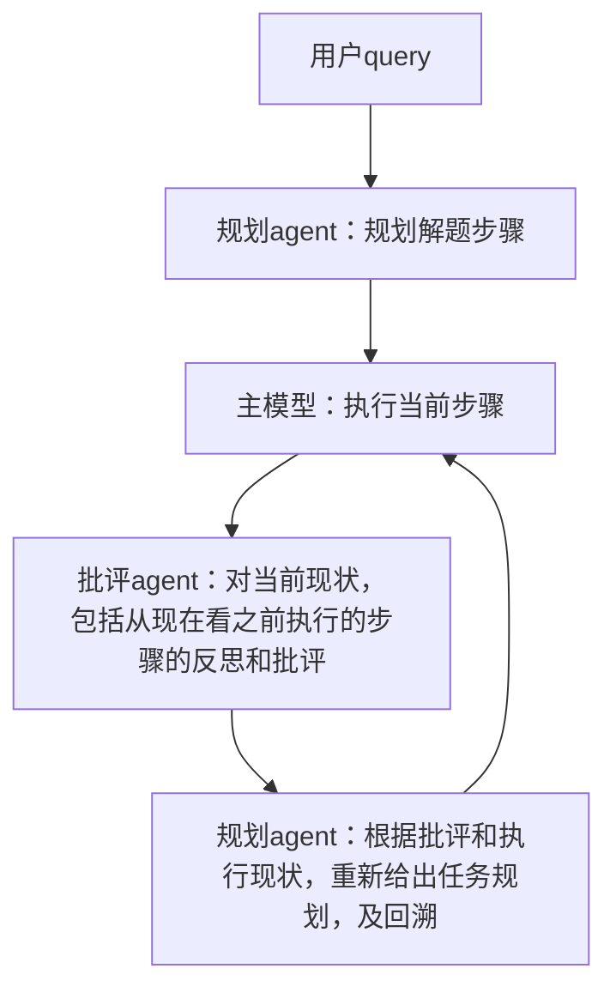

# O1

## 背景
我们认为，O1的思想在于：在训练方法已经几乎成为范式的今天，把计算资源更多的向推理倾斜，可以得到更好的效果。

而所谓的Q*或者蒙特卡洛搜索只是一种计算的方法，并不是O1的唯一实现。

我们认为，应该有一种更加简明、更加端到端的方法，可以更好地指导模型，实现规划和反思。

（现在开源的单模型推理方案，在我们看来只是带反思的cot模型而已，由于没有外部信息的接入，所以很容易陷入自身的逻辑缺陷里造成死循环）

## 实现思路
我们认为可以从顶层设计的角度更好的解决这一问题。

所以，我们将prm模型和蒙特卡洛搜索的功能（任务规划、模型执行和批评反馈）分离开，形成三大组件：
> 1. **`规划Agent（负责任务步骤规划）`**
> 2. **`主模型（执行任务步骤）`**
> 3. **`批评Agent（反思与批评执行过程）`**

这种分离架构能够更好地避免单模型推理中可能出现的死循环问题，同时为任务规划提供更清晰、反馈更明确的语义指导。

这种设计不仅可以避免传统单一模型推理中的陷入陷阱，还能使得每个组件的功能更加专注、模块化。此外，该架构便于工程实现，所有使用的技术都已成熟，并且支持LoRA进行agent训练，从而减少对大规模推理模型的依赖（一个主模型多个LoRA插件同时推理）。

## 意义
### all your need is 语义
1. 我们的思路相当于是把奖励模型的打分变成了明确的文本（即语义信息），而不是简单的奖励模型评分。我们这种明确的语义反馈，比传统的蒙特卡洛搜索更加高效，因为它能在反思过程中提供多维度的批评和指导，帮助模型进行更准确的回溯和搜索，从而避免陷入逻辑死循环。

（当然，这种分离的架构使得就算想继续用蒙特卡洛搜索也是可以的）

2. 此外，这种架构的工程实现较为简便，既能利用现有技术栈，又能通过LoRA训练优化各个模型，从而对推理过程更加友好。

## 待办事项
- [ ] 使用大模型生成适合复杂逻辑推理的问题（样本），并验证其多样性与有效性
- [ ] 手动跑通全流程，确定各环节的prompt设计及交互细节，确保流程流畅
- [ ] 确定样本存储格式，参考已有的带回溯数据格式，以便后续统一处理
- [ ] 开发前端显示与编辑工具，用于任务数据生成、修改与管理
- [ ] 训练规划模型（LoRA）
  - [ ] 初期手动构建PRM语料，逐步建立数据飞轮，后续以校验为主
- [ ] 训练批评模型（LoRA），确保其在反思与批评过程中能够有效帮助模型改进
- 增强功能
  - [ ] 使用xml标签，提供网络搜索的能力，弥补模型在信息获取和推理过程中可能的盲点，增强推理的灵活性与准确性
